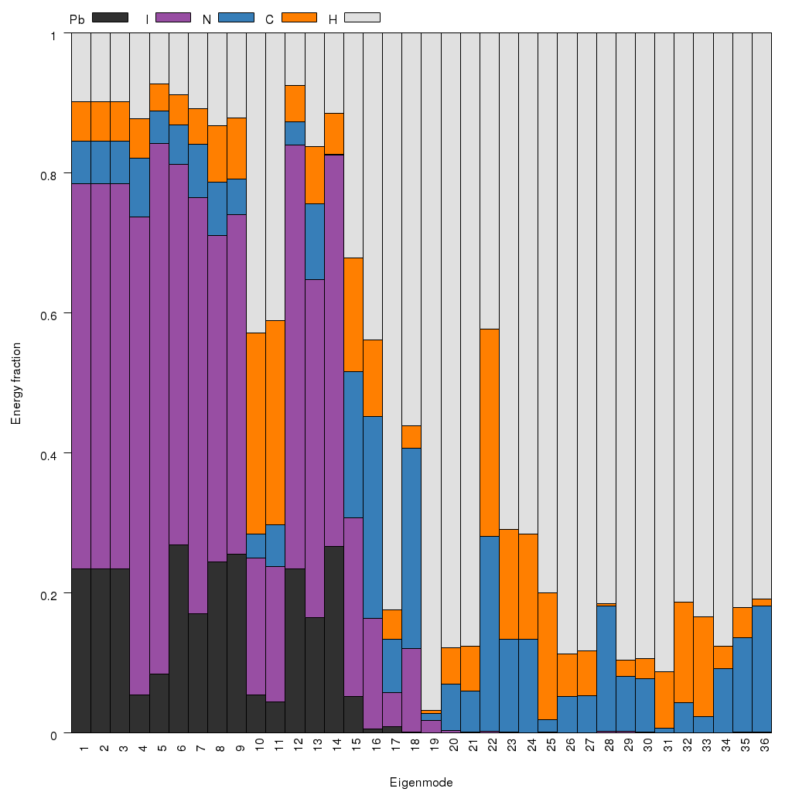

# Julia-Phonons

Codes to play with Phonons, as output from Phonopy, in Julia.



A work in progress.

Currently reads a mesh.yaml from a Phonopy calculation (Gamma only, save eigenvectors); and a 
VASP POSCAR file on this structure, to collect coordinate and atom information.

## Using this

Beware - Dragons!

First do a standard `Phonopy` calculation pipeline, to get your `FORCE_SETS` etc.,
then output the Eigenvectors to your `mesh.yaml`.

The animation part of this package assumes that the mode is at Gamma, but
(touch wood), the Inverse Participation Ratio and Atomic decomposition by
energy and displacement should also work when there's a complex phase factor,
BUT THIS IS AS YET UNTESTED.

To generate a Gamma point Eigenvectors file, your `Phonopy` input should
contain something like:
```
DIM = 2 2 2
FC_SYMMETRY = 1
MP = 1 1 1

EIGENVECTORS=.TRUE.
```

Then take your `POSCAR` and `mesh.yaml`, put them in a suitable directory with
these codes, and then edit  `phonopy_projector.jl` to do something useful with
them.

## Features

* 'Animated' .xyz files, with or without supercell expansion.
  * ((I recommend `Pymol` to visualise, with `set grid_mode,1` and  `show
    spheres` ))
* Decomposition to individual atoms, norm of Energy or Displacement weighted phonon eigenvectors
* Decomposition to atom type, for generating %fractional contribution of structure to phonon modes
* Inverse Participation Ratio (IPR) of the mode by Energy and Displacement, as
  a localisation metric.

## Future plans

* Symmetry / mode analysis
* Maybe with these exciting new 'distortion antisymmetry' ideas: http://dx.doi.org/10.1038/ncomms9818
